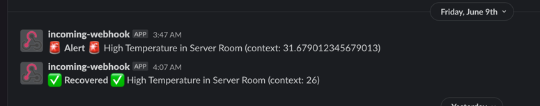

# Prometheus Gsheet

Remote write to google sheets

## Config

- LISTEN - the address to listen to, defaults to :4700
- CREDENTIALS - **required**: base64 credentials.json for google api
- SPREADSHEET_ID - **required**: the hash id from the google sheet url (i.e. the last bit
  from `https://docs.google.com/spreadsheets/d/1Wm55yV6TUN74Yjw4ButU52AUUUzA6Xkh2rfN2t0YD3Y`)

## Sheet columns

Are, in order from left to right:

- Consumed timestamp
- Metric timestamp
- Metric name
- Metric value
- Metric dimensions

## Example Google Sheet

You can copy the following google sheet and use it as a starting point.
[MetricsTemplate](https://docs.google.com/spreadsheets/d/1G07scg4xKhn8-PzlRXCxLgvTu729ayTWfZqK0MpDFRk/edit?usp=sharing)

Prometheus-gsheet will push metrics to the first sheet of the supplied document.

## Alerting

The template sheet includes alerting via slack.
You'll need to supply a slack webhook url in order for that to work (in the `Config` sheet)

Also, the `buildReport` function in the apps scripts needs a trigger (in this case every 5 minutes):

## Custom Sheet Functions

In order to be able to graph and alert on things like cpu, the following sheet functions are available via appsscript:

- TS_GROUPBY -  allows grouping by a dimension
- TS_RATE - sort of like `rate` in prometheus, useful for calculating cpu usage
- TS_DATETIME - maps first column in result from unix timestamp to a date time
- TS_AVERAGE - averages over the timeseries

Most of these functions work with or produce results where the first column is a unix timestamp.

**Note**: 
These functions are a bit of a hack to say the least. YMMV.

## Roadmap

- [ ] Rework apps script
- [ ] More example graphs
- [ ] Alert via arbitrary url
- [ ] Fix TS_RATE function, doesn't seem to handle rollover among other things.